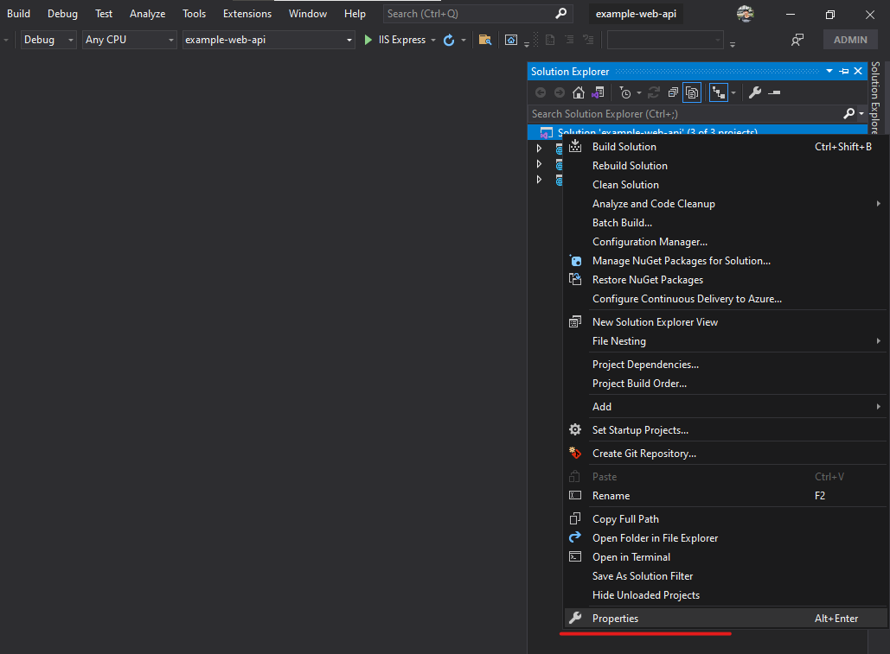
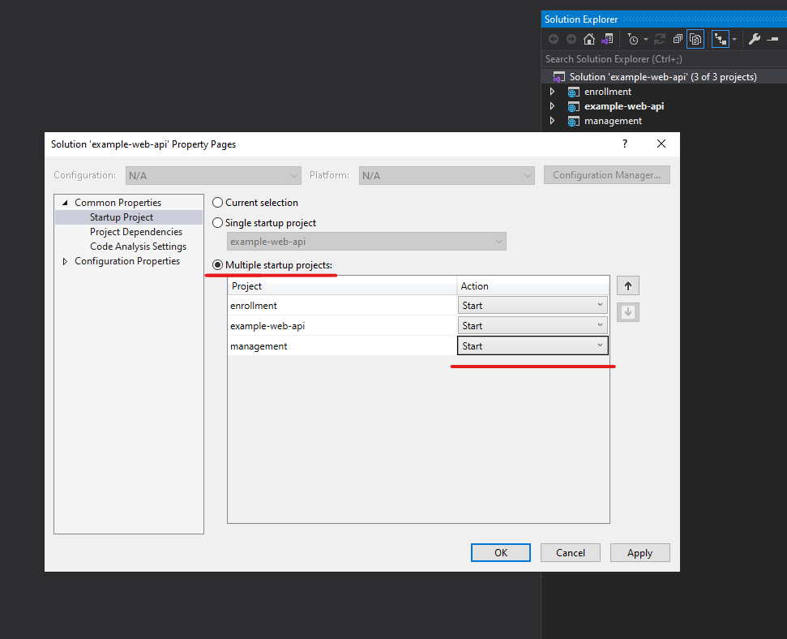
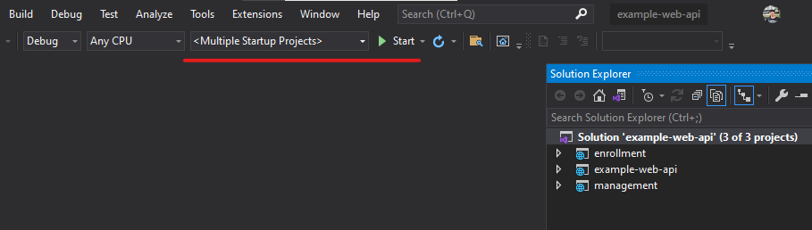
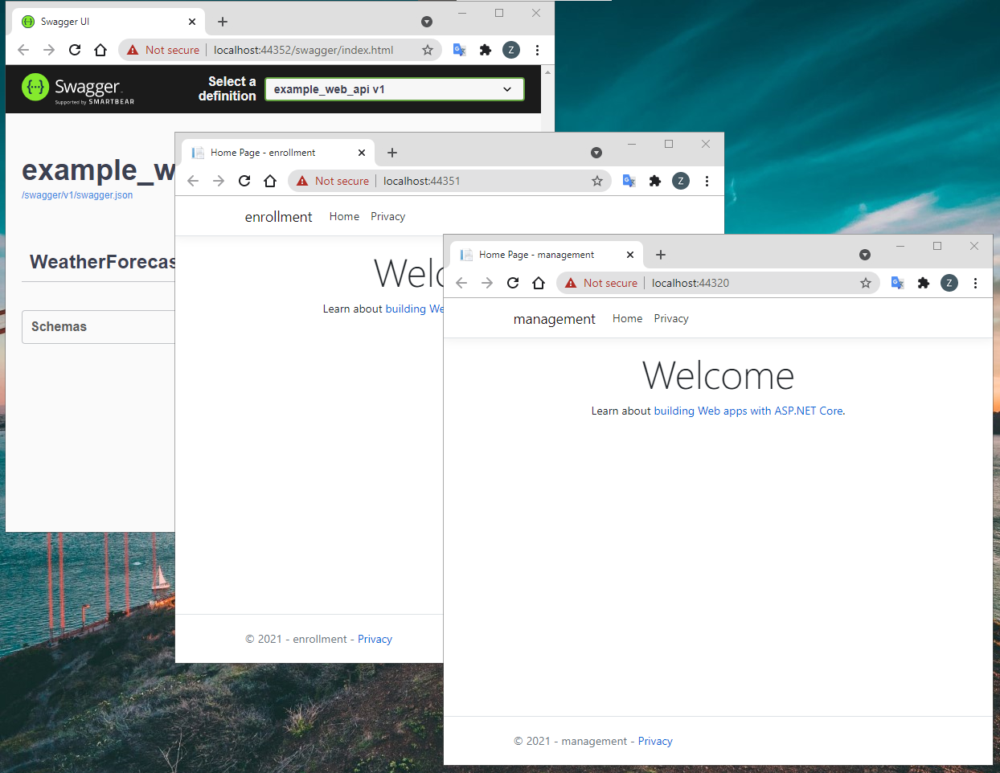

## Debug multiple projects
This content we'll setup debug multiple projects

## Steps
1. Go to Solution Explorer and right click, select properties

2. Select Multiple startup projects change action to Start and click Apply, OK

3. Put your breakpoint and let's start debugging

