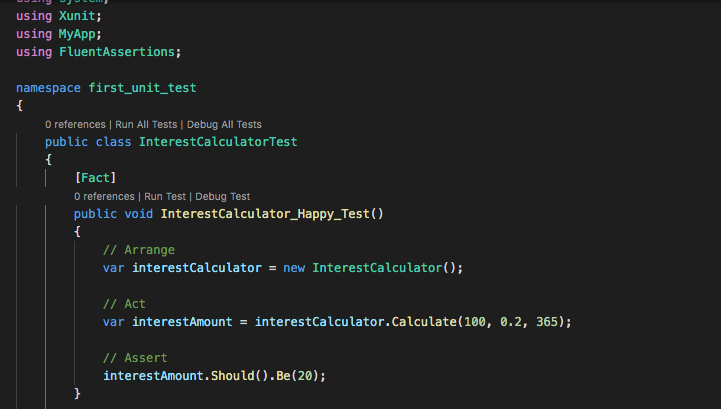
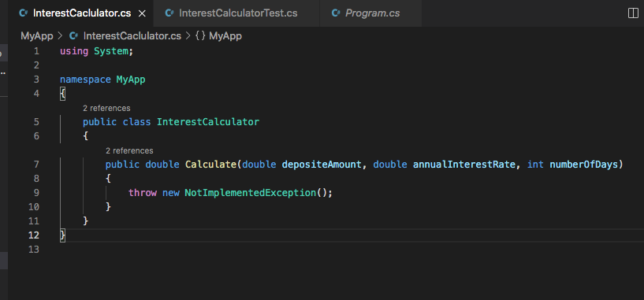
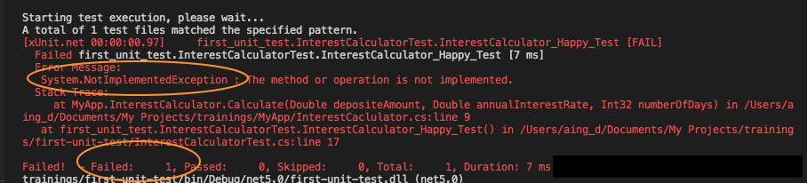
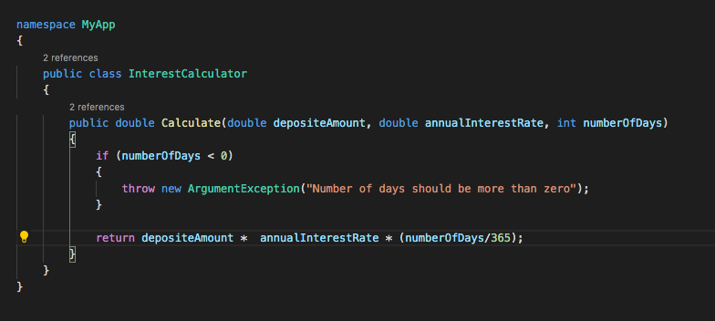
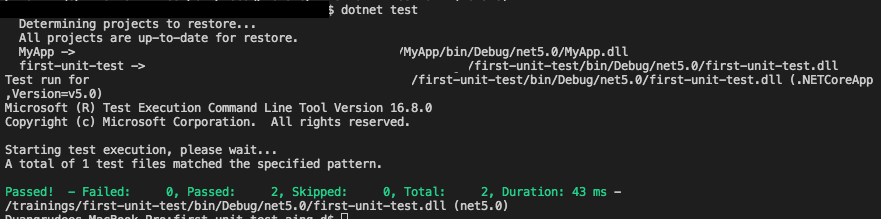

# TDD & Your first unit test in C#

วันนี้เราจะมาลองเขียน unit test สำหรับ function การคิดดอกเบี้ยเงินฝากง่ายๆ กันดู โดยเราจะมาลองฝึกทำ TDD(Test Driven Development) ด้วยการเริ่มเขียน test เอาไว้ก่อนแล้วค่อยมาเขียน function เพื่อให้เทสต์ของเราผ่านรันอีกที 


### 1. Your Happy test

รูปนี้เป็นตัวอย่างของ test โดยใส่ input ที่จะทำให้ code รันและให้ผลลัพธ์ที่ถูกต้อง 




### 2. Adding the class under test

จากนั้นเราไปสร้าง class InterestCalcultor ใน project MyApp แต่ยังไม่มี implementation เพื่อให้ test ของเรา compile ผ่านและ run ได้ก่อน (แต่ผลลัพธ์ของการรันเทสต์จะยัง fail อยู่)



### 3. Run your test

ลองรัน test ดู

```
$dotnet test
```

ซึ่งผลลัพธ์ที่ได้ก็จะ fail โดยมี error บอกว่า method ของเรานั้นยังไม่ได้ implement.



### 4. Add Unhappy Test

จากนั้นเรามาเติม test case ในกรณีที่จะทำให้ method รันแล้วไม่ได้ผลลัพธ์กันดูบ้าง เช่น ลองใส่ argument เป็นลบ และเติม assert section โดยคาดหวังให้ function under test ของเรานั้น throw exception ออกมา และมีช้อความบอกสาเหตุของ error

### 5. Add a simple implementation (Just enough to pass all your tests)

หลังจากได้เทสต์ที่ครอบคลุมทั้ง happy test และ unhappy test แล้ว เราก็มาเติม implementation ใหักับ class InterestCalculator เพื่อให้ได้ผลลัพธ์ตามที่ expect



### 6. Run your test (agin)

ลองรัน test ดู คราวนี้เราควรจะได้ผลลัพธ์ที่ว่า test ผ่าน โดยขึ้นว่ามีเทสต์รันผ่านทั้งหมด 2 จาก 2 cases

```
$dotnet test
```



-----

จากตัวอย่างและขั้นตอนด้านบนที่กล่าวมา เป็นตัวอย่างการเทสต์ class และ function ที่ไม่ซับซ้อน และ class InterestCalculator ก็ไม่ได้มีการเรียกใช้ class อื่น หรือมี dependecendies กับ class อื่นๆ 
ซึ่งในบนความหน้าจะมายกตัวอย่าง class ที่ซับซ้อนมากขึ้น แล้วมาลองดูเทคนิคการ refactor code เพื่อให้เขียนเทสต์ง่ายขึ้นกัน แต่สำหรับตัวอย่างที่ยกมาในวันนี้ หวังว่าเพื่อนๆจะสามารถลองไปหา function ง่ายๆใน code ของคุณแล้วลองเขียนเทสต์ง่ายๆกันดู -- ขอบคุณค่ะ