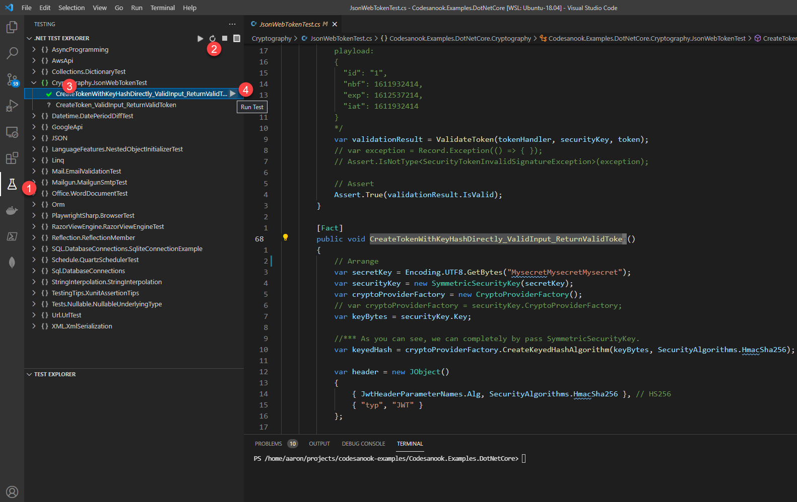

# Run xUnit test cases in VS Code

## Install .NET Core Test Explorer
- Open VS Code at root of your project that container a unit test code.
- After VS Code is ready, click Extensions icon on left sidebar menu.
- Search for ".NET Core Test Explorer", then click install.

## Run a test case
1. On left sidebar menu, click Testing icon.
2. You should find your test cases grouped by a namespace. If not, click a refresh button.
3. Expand a namespace to find your test case.
4. Click a "Run Test" button to run an individual test or click the button on a namespace to run all test cases in a namespace.
5. If your test passes, you should find a green check mark before your test case's name. If not, you will find a red cross mark instead.

# Useful link
- [Learn more about .NET Core Test Explorer](https://marketplace.visualstudio.com/items?itemName=formulahendry.dotnet-test-explorer)
