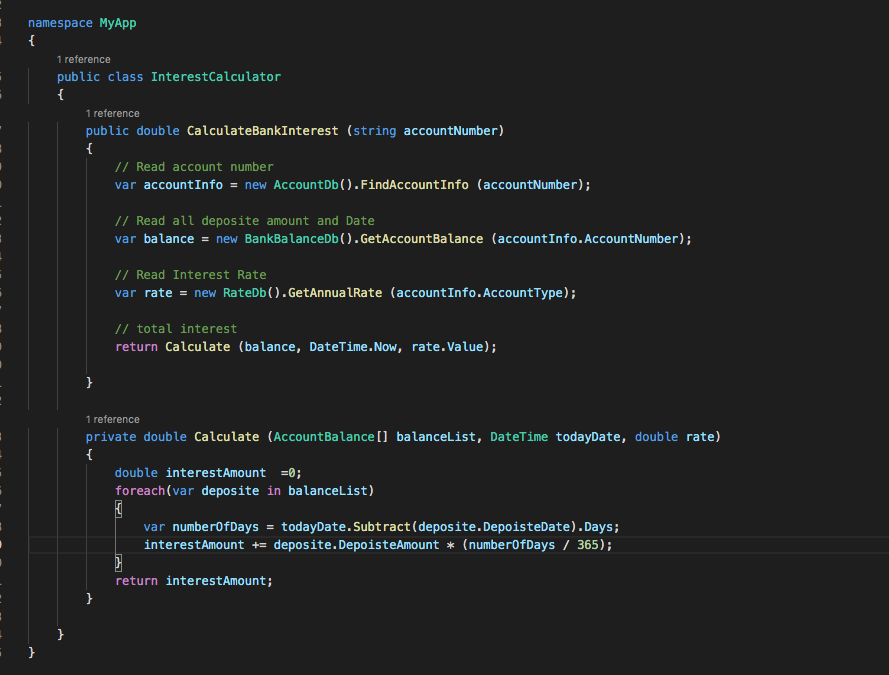
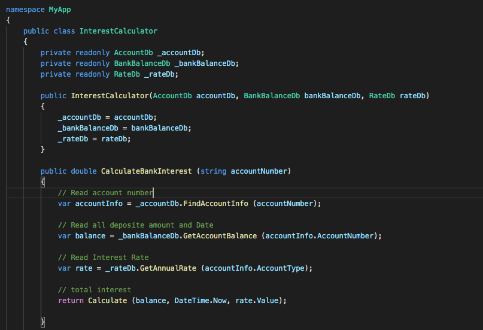
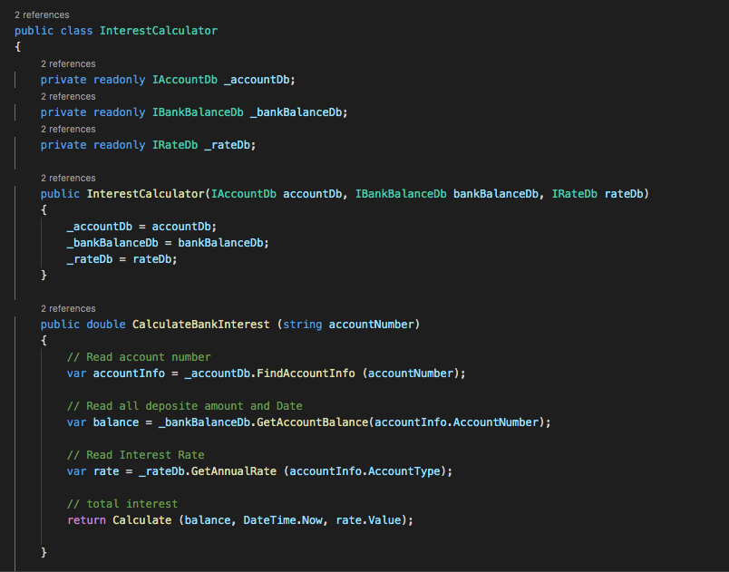
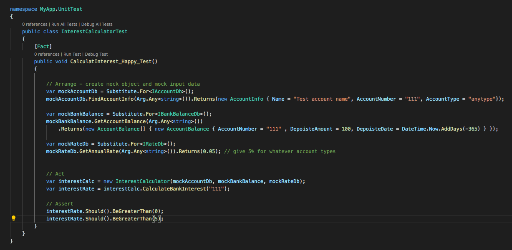
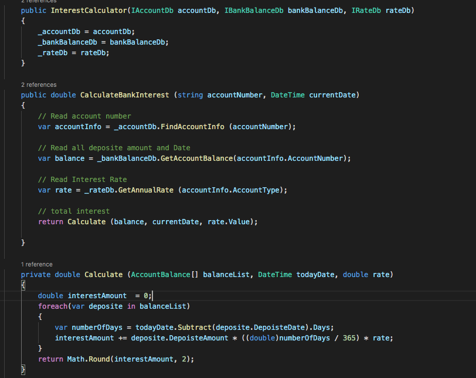
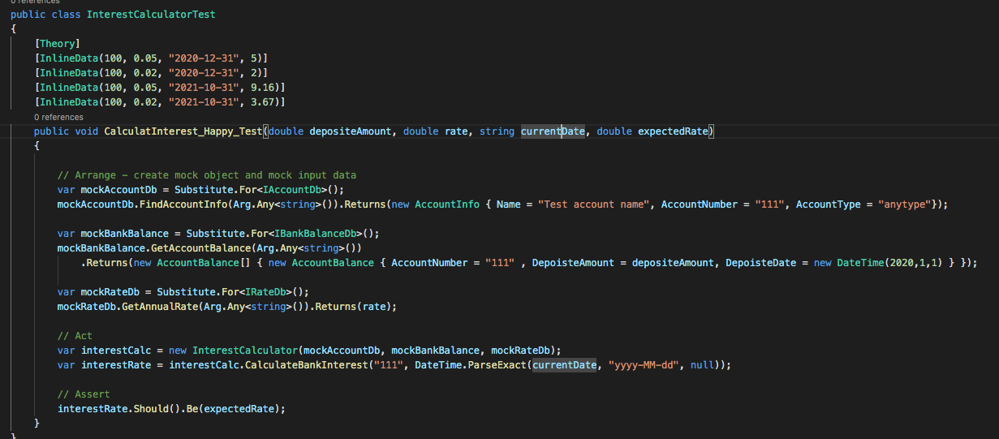

# Testing a complex class


## What is a complex class?

ก่อนอื่นเรามาดูกันก่อนว่า คลาสที่มีความซับซ้อนมันคืออะไร เราลองมาดูตัวอย่างในรูปกัน



จากตัวอย่างข้างบน เรามี class ชื่อ `InterestCalculator` ที่มี 1 public method ชื่อ `CalculateBankInterest` ซึ่งมีการทำงานคร่าวๆ คือ 

1. อ่านข้อมูลของเลขที่บัญชีที่ส่งเข้ามาเป็น input
2. อ่านดูว่ามีเงินอยู่ในบัญชีนั้นเท่าไร และฝากเข้ามาวันไหน
3. อ่านดูว่าบัญชีนั้นควรให้อัตราดอกเบี้ยกี่เปอร์เซ็นต์
4. เรียก private function ชื่อ `Calculate` เพื่อคำนวณค่าดอกเบี้ย

ถ้าดูเผินๆอาจจะดูเหมือนว่า function `CalculateBankInterest` ไม่ได้มีความซับซ้อนอะไรมาก และแต่ละขั้นตอนที่ทำเราก็มีการแยก code ออกไปเป็น class ใหม่เรียบร้อยแล้ว ฟังก์ชันนี้ที่จะมีก็เพียงแค่ไปเรียกใช้ class อื่นๆ แล้วสุดท้ายก็เอามาคิดคำนวณ

แต่ถ้ามองให้ลึกไปถึง dependencies หรือ class ที่ method นี้ไปเรียกใช้ ก็จะเห็นได้ว่ามันมีการไปเรียกใช้คนอื่น อยู่ถึง 3 classes ก่อนที่มันจะเริ่มทำการคำนวณได้ นั่นก็คือ class 
- `AccountDb`
- `BankBalanceDb`
- `RateDb` 

----

## Classes with many dependencies are difficult to test

การมี dependecies กับคลาสอื่น ทำให้ method `CalculateBankInterest` นั้นยากต่อการเขียนเทสต์, ควบคุม input ของ function และจะเห็นได้ว่า method `CalculateBankInterest` ไม่ได้ทำงานตรงไปตรงมาอย่างที่เห็นในตอนแรก เพราะมันไม่ได้แค่รับ bank account number แล้วเอาไปคำนวณอย่างที่เข้าใจซะทีเดียว ผลลัพธ์ ของ function จะไปขึ้นกับว่า class `AccountDb`, `BankBalanceDb`, `RateDb` จะ return ค่าอะไรออกมาอีกด้วย

หลายคนอ่านมาถึงตรงนี้อาจจะเริ่มสงสัยว่า 
- เราต้องตามไป test class ที่เราไปเรียกใช้ด้วยรึเปล่านะ? 
- แล้วถ้า class เหล่านั้นต้องไปอ่านข้อมูลจาก database จริงๆ แลัวเราจะมี database อะไรมาให้ใช้ตอนรันเทสต์กันล่ะ? 
- ต้องเตรียม test data ไว้ยังไง? 
- หรือถ้าต้องไปขอข้อมูลจาก web service ผ่าน REST API ล่ะจะต้องทำยังไง? 

แน่นอนถ้าต้องเป็นอย่างนั้น test ของคุณคงไม่ใช่ unit test อีกต้องไปแล้วอะไรๆ มันก็ดูเริ่มจะยุ่งยากขึ้นซะแล้ว...

-----

## Breaking Dependencies using DI (Dependency Injection)

จากปัญหาข้างบนที่กล่าวมา วันนี้จะลองพาทุกคน refactor code ให้ง่ายต่อการเขียนเทสต์ ด้วยการจับเอา class ที่เราต้องการจะเทสต์แยกออกจาก dependencies ด้วยเทคนิคที่ชื่อว่า `Dependency injection`

[Dependency injection](https://en.wikipedia.org/wiki/Dependency_injection) เป็นหนึ่งในเทคนิคของหลักการ [Inversion of control (IoC)](https://en.wikipedia.org/wiki/Inversion_of_control) ซึ่งนิยามและความหมายอย่างเป็นทางการนั้นสามารถหาอ่านได้ใน link ที่ให้ไป 

แต่สำหรับคำแปลแบบง่ายๆ ก็คือแทนที่เราจะให้ method ของเราทำหน้านี้สร้าง instance ของ dependency class แล้วเรียกใช้ (new instance > and call a method), เราจะใช้การจับเอา class ที่เราไปเรียกใช้ออกมา pass เป็น parameters (Inject > and call a method)แทน

 ซึ่งอาจจะเป็นการส่งมาเป็นหนึ่งใน arguments ของ method นั้นๆ หรือโยนเข้ามาใน constructor ของคลาสเราก็ได้(ซึ่งวิธีหลังนี้จะนิยมมากกว่าเพราะสามารถดึงเอา IoC container อย่างเช่น Ninject หรือ Autofac เข้ามาช่วยได้พอ app เราใหญ่มากขึ้น) และถ้าจะให้สามารถควบคุม input ได้ตามที่ test เราต้องการเราควรทำ dependencies เหล่านั้นให้เป็น interface แล้วส่ง interface เข้ามาแทน

-----

## Enough talking, let's see the example

เรามาลองจัด code เราใหม่โดยใช้หลักการ dependency injection กัน

### Step 1- เอา dependencies classes ไปเป็น constructor parameters

เราได้จะ code ตามรูปนี้



code ของเราก็จะยังทำงานได้เหมือนเดิมไม่ได้เปลี่ยน logic ด้านในอะไร แต่จะต้องไปแก้ class ที่มาเรียกใช้ class `InterestCalculator` อีกที ให้ส่ง instance ของ `AccountDb`, `BankBalanceDb`, `RateDb` เข้ามาเป็น constructor paramters ซึ่งในจุดนี้ถ้า application ของเราใหญ่มากขึ้นมี dependecies เยอะขึ้นเราสามารถนำเอา Autofac หรือ Ninject มาช่วยเรื่องการ Register & Resolve dependencies ได้


### Step 2 - Create interfaces แล้วส่ง interface เข้ามาแทน

เราจะสร้าง interface ขึ้นมาใหม่ 3 interfaces แล้วให้ class dependencies ของเราเป็น implementation ของ interface เหล่านั้น คือ

- `AccountDb` is an implementation of interface `IAccountDb`
- `BankBalanceDb` is an implementation of interface `IBankBalanceDb`
- `RateDb` is an implementation of interface `IRateDb`

ขั้นตอนนี้หลายคนอาจจะเห็นว่าไม่จำเป็น ที่ถ้าเราต้องการที่จะ mock dependencies ของเราให้ได้หลากหลายรูปแบบ ขั้นตอนนี้ถือว่าสำคัญมากๆ

นอกจากนี้การทำ code ของคุณให้ depends on interface แทนที่จะ depends on class instances จะทำให้ code ของคุณสามารถ scale ได้มากขึ้นอีกด้วย ยกตัวอย่างเช่น ถ้าในอนาคตคุณต้องการย้ายที่เก็บ data จาก database ไปเป็นไปไว้บน Web Service หรือ in memory ก็สามารถไปเพิ่ม implementation ของ interface ได้ โดยไม่ต้องกลับมาแก้ class `InterestCalculator` อีก



-----

## Now you can start adding Unit tests for InterestCalculator class

Run the following command (สามารถอ่านรายละเอียดแต่ละขั้นตอนได้ที่บทความ xUnit project setup )

```
$ cd [Project working directory] (One layer before MyApp)
$ mkdir MyApp.UnitTest
$ cd MyApp.UnitTest
$ dotnet new xunit
$ dotnet add package Microsoft.NET.Test.Sdk
$ dotnet add package xunit 
$ dotnet add package FluentAssertions
$ dotnet add package NSubstitute
```

Add MyApp Project reference

```
<ItemGroup>
<ProjectReference  Include="..\MyApp\MyApp.csproj"/>
</ItemGroup>
```

จากนี้เราก็สามารถเริ่มเขียน unit test ของ class InterestCalculator โดยเริ่มจากการสร้าง mock ของ interface IAccountDb, IBankBalanceDb, IRateDb และใช้ framework ที่มาช่วยในการ mock object (เช่น NSubstitute หรือ Moq) มากำหนดค่าที่อยากให้ interace เหล่านั้น return ออกมา ซึ่งเราก็สามารถกำหนดได้ทั้งที่ happy, และ unhappy case ได้




-----

## Try to make your code, better

ก่อนจะจบบทความนี้ไป หลายคนอาจจะพอสังเกตุเห็นได้ว่า function CalculateBankInterest ยังไม่ใช่ `pure function` กล่าวคือมันมีการไปเรียกใช้ dependencies อีกตัวนึง ก็คือ `DateTime.Now ` ที่จะสามารถให้ค่าออกมาปลี่ยนไปเรื่อยๆ ขึ้นกับเครื่อง วัน เวลา ที่ run ลักษณะของ function แบบนี้จะทำให้ unit test ของเราไม่ stable และควบคุมค่า input + expected output ได้ยาก

สิ่งที่เราควรทำก็คือให้มอง System.DateTime ให้เป็นเหมือน dependencies อีกอย่างนึง แล้วลองใช้เทคนิค dependencies injection มา refactor method ของเราดู ผลลัพธ์ที่ได้ก็จะออกมาแบบนี้ 



แล้วเราก็จะสามารถเพิ่ม test case ให้ครอบคลุมได้มากขึ้นอีกด้วยโดยทำให้ xUnit เราเป็น parameterised test ตามในตัวอย่างนี้ (ซึ่งผู้เขียนก็เพิ่งรู้ว่าโค้ดตัวอย่างมีบั้กจนได้เริ่ม add more test case เข้าไปนี่แล่ะ 😂





## Full example code

ทุกท่านสามารถ clone / fork code ตัวอย่างทั้ง version เต็มทั้งก่อนและหลัง refactor ได้ที่ https://github.com/duangrudee/CSharpUnitTestExample