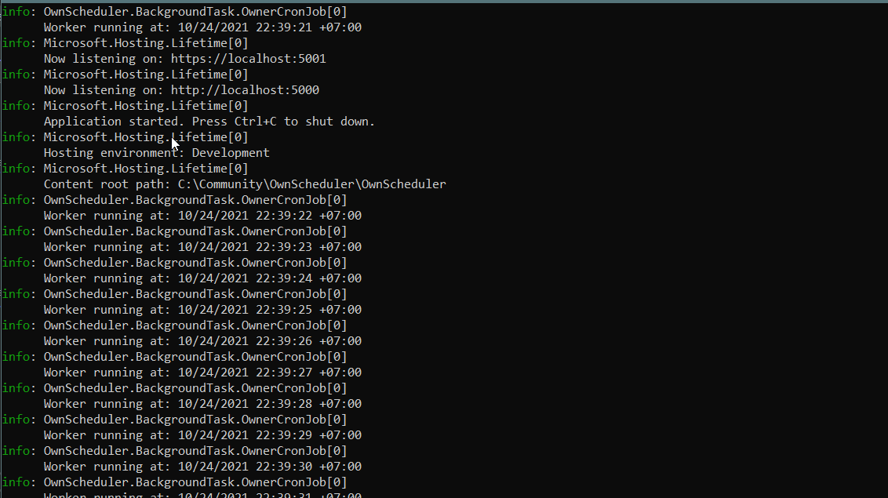
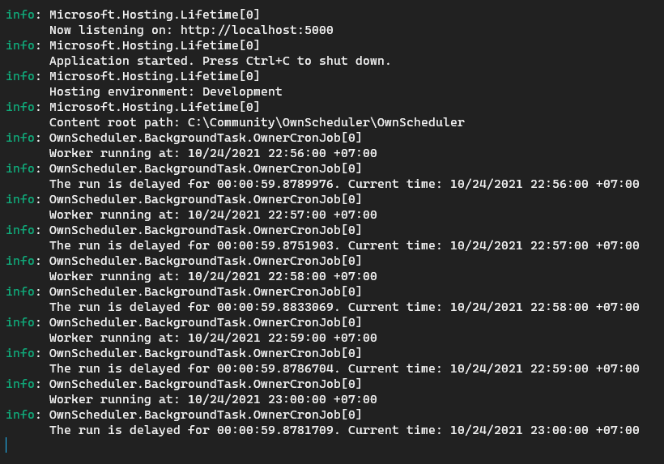

# เขียน Scheduler using .NET Background service ด้วยตัวเอง
การตั้งเวลาเพื่อทำงานบ้างอย่างเป็นสิ่งที่พบได้บ่อย และเป็นการทำงานพื้นฐานของหลายๆระบบ และหลายๆภาษาก็ให้ทางเลือกในการที่จะ implement ที่แตกต่างกัน

สำหรับชาว .NET เราก็มี libraries มากมาย ยกตัวอย่างเช่น TopSelf, Quartz, Hangfire เป็นต้น แต่อย่างไงก็ต่างเราสามารถ implement เองในทางที่ง่ายและหลีกเลี่ยง external dependency

โดยเนื้อหานี้เราจะให้ .NET [BackgroundService](/dotnet/api/microsoft.extensions.hosting.backgroundservice?view=dotnet-plat-ext-5.0) ในการ implement โค้ดกัน

## SOURCE CODE
เพื่อนๆสามารถตามไปที่ [Github repository](https://github.com/execution/OwnScheduler) นี้สำหรับ source code ที่เขียนในบทความนี้ครับ

## เริ่มกันเลย
เรามาเริ่มจาก code การทำ worker ปกติกันก่อนสำหรับ BackgroundService

```cs
using System;
using System.Collections.Generic;
using System.Linq;
using System.Threading;
using System.Threading.Tasks;
using Microsoft.Extensions.Hosting;
using Microsoft.Extensions.Logging;

namespace OwnScheduler.BackgroundTask
{
    public class Worker : BackgroundService
    {
        private readonly ILogger<Worker> _logger;

        public Worker(ILogger<Worker> logger)
        {
            _logger = logger;
        }

        protected override async Task ExecuteAsync(CancellationToken stoppingToken)
        {
            while (!stoppingToken.IsCancellationRequested)
            {
                _logger.LogInformation("Worker running at: {time}", DateTimeOffset.Now);
                await Task.Delay(1000, stoppingToken);
            }
        }
    }
}
```
เมื่อเรา run เราจะเห็นผลลัพธ์ตามนี้



ต่อไปเราจะมาทำการสร้าง Recurring task ด้วยสิ่งที่เรียกว่า [CRON](https://cron.help/) Expresion โดยผมจะใช้ตัวที่ผมว่าดีและใช้ง่ายนั้นก็คือ [CRONOS](https://github.com/HangfireIO/Cronos) library เพื่อมาแปล CRON expression นั้นเอง

```cs
using Cronos;
using Microsoft.Extensions.Configuration;
using Microsoft.Extensions.Hosting;
using Microsoft.Extensions.Logging;
using System;
using System.Threading;
using System.Threading.Tasks;

namespace OwnScheduler.BackgroundTask
{
    public class OwnerCronJob: BackgroundService
    {
        private readonly IConfiguration _configuration;
        private readonly ILogger<OwnerCronJob> _logger;
        public OwnerCronJob(IConfiguration configuration, ILogger<OwnerCronJob> logger)
        {
            _configuration = configuration;
            _logger = logger;
        }

        protected override async Task ExecuteAsync(CancellationToken stoppingToken)
        {
            var cronExpression = _configuration.GetValue<string>("cronExpression");
            while (!stoppingToken.IsCancellationRequested)
            {
                // Schedule the job
                await WaitForNextSchedule(cronExpression);

                // Task to run
                await ProcessAsync(stoppingToken);
            }
        }

        private async Task ProcessAsync(CancellationToken stoppingToken)
        {
            _logger.LogInformation("Worker running at: {time}", DateTimeOffset.Now);
            await Task.Delay(100, stoppingToken);

        }


        /// <summary>
        ///                                           Allowed values    Allowed special characters Comment
        ///
        ///    ┌───────────── second(optional)        0-59              * , - /
        ///    │ ┌───────────── minute                0-59              * , - /
        ///    │ │ ┌───────────── hour                0-23              * , - /
        ///    │ │ │ ┌───────────── day of month      1-31              * , - / L W ?
        ///    │ │ │ │ ┌───────────── month           1-12 or JAN-DEC* , - /
        ///    │ │ │ │ │ ┌───────────── day of week   0-6  or SUN-SAT* , - / # L ?                Both 0 and 7 means SUN
        ///    │ │ │ │ │ │
        ///    * * * * * *
        /// </summary>
        /// <param name="cronExpression"></param>
        /// <see cref="https://github.com/HangfireIO/Cronos"/>
        /// <returns></returns>
        private async Task WaitForNextSchedule(string cronExpression)
        {
            var parsedExp = CronExpression.Parse(cronExpression);
            var currentUtcTime = DateTimeOffset.UtcNow.UtcDateTime;
            var occurenceTime = parsedExp.GetNextOccurrence(currentUtcTime);

            var delay = occurenceTime.GetValueOrDefault() - currentUtcTime;
            _logger.LogInformation("The run is delayed for {delay}. Current time: {time}", delay, DateTimeOffset.Now);

            await Task.Delay(delay);
        }
    }
}

```
ซึ่งตัว CRON Expression ผม configure ที่ appsettings.json ดังนี้
```json
{
  "Logging": {
    "LogLevel": {
      "Default": "Information",
      "Microsoft": "Warning",
      "Microsoft.Hosting.Lifetime": "Information"
    }
  },
  "AllowedHosts": "*",
  "cronExpression": "* * * * *" // Run once a minute at the beginning of the minute
}

```
โดยจะ load ค่าด้วย  `var cronExpression = _configuration.GetValue<string>("cronExpression");`

ได้ผลลัพธ์ตามภาพ


## WRAPPING UP
ในบทความนี้เราได้อธิบายการ implement scheduler service โดยไม่พึ่ง external library หรือ serverless functions
