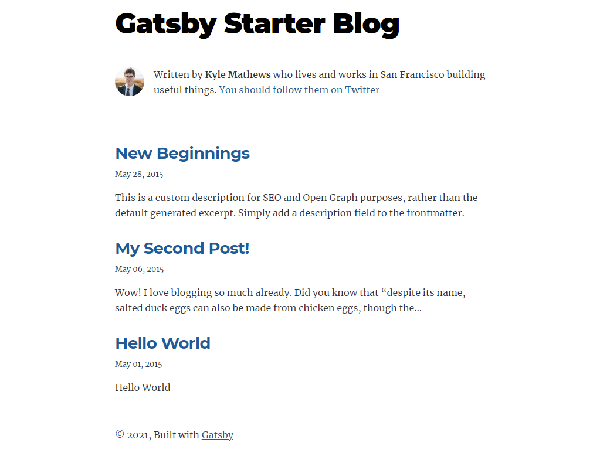
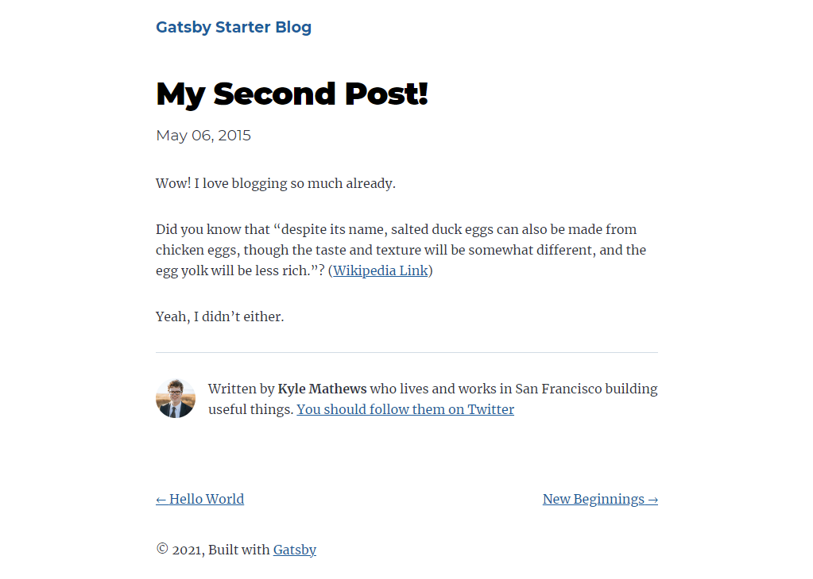

# Prerequisite
- Git
- Node.js 10.13.0 (LTS) or higher
- Yarn

## How to instal Gatsby as a global tool
- If you haven't installed Yarn yet, execute the following command in a terminal:
```sh
$ sudo npm install -g yarn
```

# Install gatsby-cli as a global tool
- Open a new terminal.
- Execute the following command to install gatsby-cli:
```sh
$ sudo yarn global add gatsby-cli
```

# Create a simple website from Gatsby Starters
- Execute the following command in a terminal to create a new Gatsby website:
```sh
$ gatsby new my-gatsby-website https://github.com/gatsbyjs/gatsby-starter-blog
```
- Wait for a while until a command has finished.
- Then CD to the project folder.
```sh
$ cd my-gatsby-website
```
- Start the website in development mode by executing the following commands:
```sh
gatsby develop
```
- Open a browser and navigate to [http://localhost:8000](http://localhost:8000).
- You should find homepage and post details page as following images:

### Gatsby Starter Blog - homepage



### Gatsby Starter Blog - post details page



- You has just setup a Gatsby website successfully.
- You can also browse more Gatsby Starters from this link [https://www.gatsbyjs.com/starters](https://www.gatsbyjs.com/starters).
