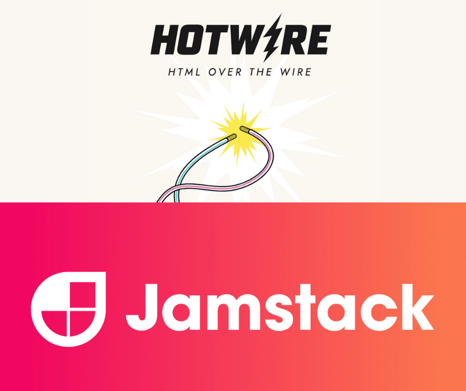

# Hotwire VS Jamstack
[เว็บไม่ได้เปลี่ยน นายนั่นแหละที่เปลี่ยน]
บล็อกคุณ Remy Sharp บอกว่า เว็บมันก็คือ HTML+CSS มาแต่ไหนแต่ไร แต่ผู้คนกลับทำให้มันยาก สร้าง Framework มาสารพัด อ้อมโลกผ่าน API ต่างๆ เพื่อมาทำเรื่องง่ายๆ อย่างการแสดงผลข้อความ
ลิงก์: https://remysharp.com/2021/02/11/the-web-didnt-change-you-did

ทำให้คนพบว่า ตอนนี้มี 2 แนวทางของการทำเว็บที่น่าศึกษา

1. ฝั่ง Server ให้ Server เป็นคนส่งเนื้อหาตรงๆ มาทางเว็บเลย อารมณ์ ajax สมัยก่อน เจาะช่อง HTML ไว้แล้ว push เนื้อหาที่ต้องการเปลี่ยนมาใส่ คนเสนอแนวทางนี้ก็คือ ทีม Basecamp ผู้สร้าง Ruby on Rails และมาลองทำใช้จริงกับ Hey.com ลิงก์: https://hotwire.dev/

2. ฝั่ง Client ใช้ JS ไปดึงเนื้อหาผ่าน API ต่างๆ มา แล้วเอามาแสดงผล ทีมที่เสนอแนวทางนี้มีหลายเจ้า แต่ที่ใช้คำว่า Jamstack คือ Netlify ซึ่งรองรับ JS Framework จำนวนมาก ลิงก์:  https://jamstack.org/

# Implementation Framework
- [Turbo (Ruby)](https://github.com/hotwired/turbo)
- [Turbolinks (PHP)](https://github.com/helthe/Turbolinks/)
- [TurboLinks.Net (C# .NET Core 2)](https://github.com/TerribleDev/TurboLinks.Net)

**Please note that** Turbolinks is no longer under active development.
It has been superseded by a new framework called Turbo, which is part of the Hotwire umbrella.

# Credit
- [ดัดแปลงจากเนื้อหาใน page คุณเม่น Menn](https://www.facebook.com/MennBlog/posts/3692429137471275)

