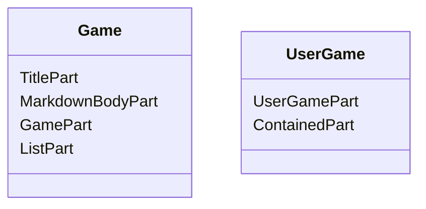

# Introduction
If we want to create a content item which can contains other content items.
We can create a new content type with `ListPart` and use it as a parent/container.
Then create a child content item with `ContainedPart` to associate it with its parent.
This list content item can be applied to many situation, e.g. a blog contains a list blog posts, an order contains a list of products.

# Example content types
We want to create a number guessing game that allows a user to guess a number.
Here are our simple content types:
- `Game` content type, it is a container or parent which contains multiple UserGame content items.
- `UserGame` content type, it is a contained type or child which is contained by Game content item.


**Note** `GamePart` and `UserGamePart` are custom content parts.

In `Migrations.cs`, we define `Game` and `UserGame` content types as the following code:
```cs
  public int Create()
  {
      _contentDefinitionManager.AlterPartDefinition(
          nameof(GamePart),
          part => part.Attachable(true).WithDescription("Provide GamePart to a content item.")
      );

      _contentDefinitionManager.AlterPartDefinition(
          nameof(UserGamePart),
          part => part.Attachable(true).WithDescription("Provide UserGame to a content item.")
      );

      const string userGameTypeName = "UserGame";
      _contentDefinitionManager.AlterTypeDefinition(
          userGameTypeName,
          type => type
              .WithPart(nameof(UserGamePart))
              .Creatable()
              .Versionable(false)
              .Draftable(false)
              .Listable()
      );

      _contentDefinitionManager.AlterTypeDefinition(
          "Game",
          type => type
              .WithPart(nameof(TitlePart), part => part.WithPosition("0").WithDisplayName("Game title"))
              .WithPart(
                  nameof(MarkdownBodyPart),
                  part => part.WithEditor("Wysiwyg").WithPosition("1").WithDisplayName("Game rule")
              )
              .WithPart(nameof(GamePart).WithPosition("2"))
              .WithPart(
                  nameof(ListPart),
                  part => part.WithSettings(new ListPartSettings()
                  {
                      ContainedContentTypes = new[] { userGameTypeName },
                      PageSize = 50,
                  })
              )
              .Creatable()
              .Versionable(false)
              .Draftable(false)
              .Listable(false)
      );

      return 1;
  }

```
**Note** if you have custom parts like `GamePart` and `UserGame`, you need to create a content part drivers and register them in `Startup.cs` file.

# How to create a child content item programmatically.
- If we want to create a child content item (UserGame) on frontend with an alternate shape e.g. `Content-UserGame.cshtml` as the following HTML form.
We need to pass `ListPart.ContainerId` and `ListPart.ContentType` as query string values to associate it with a container/parent content item (Game).
  ```html
    @using OrchardCore.DisplayManagement.Zones
    <style asp-src="~/OrchardCore.Contents/Styles/Contents.min.css" debug-src="~/OrchardCore.Contents/Styles/Contents.css">
    </style>

    <form
      method="post"
      asp-action="Create"
      asp-route-ListPart.ContainerId="@gameContentItemId"
      asp-route-ListPart.ContentType="UserGame">
      <div class="edit-container">
        <div class="edit-body">
          <div class="edit-item-parts">
            @if (Model.Parts != null)
            {
              @await DisplayAsync(Model.Parts)
            }
          </div>

          @if (Model.Actions != null)
          {
            <div class="edit-item-secondary group">
              <div class="edit-item-actions form-group">
                @await DisplayAsync(Model.Actions)
              </div>
            </div>
          }
        </div>
      </div>
    </form>
  ```
- **Note** you can also pass `ListPart.EnableOrdering` query string as true to enable ordering a list.
- Then in a custom action method, we can create a UserGame content item as usual.
  ```cs
      [HttpPost]
      public async Task<IActionResult> Create()
      {
          var contentItem = await _contentManager.NewAsync("UserGame");
          contentItem.Owner = User.FindFirstValue(ClaimTypes.NameIdentifier);
          contentItem.Author = User.FindFirstValue(ClaimTypes.Name);

          if (!await _authorizationService.AuthorizeAsync(User, CommonPermissions.EditOwnContent, contentItem))
          {
              return Forbid();
          }

          var typeDefinition = _contentDefinitionManager.GetTypeDefinition(contentItem.ContentType);
          try
          {
              var model = await _contentItemDisplayManager.UpdateEditorAsync(contentItem, _updateModelAccessor.ModelUpdater, true);
              if (ModelState.IsValid)
              {
                  await _contentManager.CreateAsync(contentItem, VersionOptions.Published);
              }
              await _notifier.SuccessAsync(H["{0} has been created.", typeDefinition.DisplayName]);
          }
          catch (Exception ex)
          {
              await _session.CancelAsync();
              await _notifier.ErrorAsync(H["An error occurred while creating {0}.", typeDefinition.DisplayName]);
              _logger.LogError(ex, "An error occurred while creating {typeDisplayName}.", typeDefinition.DisplayName);
          }

          return View();
      }
  ```

# Why do we need to set `ListPart.ContainerId` and `ListPart.ContentType` as query string values?
- [ContainedPartDisplayDriver](https://github.com/OrchardCMS/OrchardCore/blob/main/src/OrchardCore.Modules/OrchardCore.Lists/Drivers/ContainedPartDisplayDriver.cs#L74) which is responsible to set values of ContainedPart's properties requires us to pass these values to it:
  - `ListPart.ContainerId` is a parent's ContentItemId for associating a child content item to its parent.
  - `ListPart.ContentType` is used by the driver to check if the current content item matches its value to make sure we don't apply `ContainedPart` to unintended type. This is because the driver is always called by any content item whenever we display/edit/update a content item.

# Why we can't attach ContainedPart when we defined a child type (UserGame) in Migrations.cs
- If we defined a new item with ContentedPart in its' definition, we will get a new content item with ContainedPart which has ContainerId's value equal to null.
- When ContainedPartDisplayDriver finds a content item has ContainedPart, it will render `ListPart_ContainerId` shape which set hidden input field with name to `ListPart.ContainerId` and value to `null` in [ListPart.ContainerId.cshtml](https://github.com/OrchardCMS/OrchardCore/blob/main/src/OrchardCore.Modules/OrchardCore.Lists/Views/ListPart.ContainerId.cshtml) template.
- Even thought we send `ListPart.ContainerId` as query string, it can't override value of `ListPart.ContainerId` which is passed as hidden input field because ASP.NET Core MVC model binding will take a value of form field before query string as [mentioned in this document](https://docs.microsoft.com/en-us/aspnet/core/mvc/models/model-binding?view=aspnetcore-6.0#sources). This results in a child item can't associate to its parent.

# Render a list content item
- To render a parent content item (UserGame) and its child content items (UserGame), we can create an alternate template in a `Views` folder of our customer module as the following code.
  ```html
    @* Views/Game-ListPart.cshtml *@
    @model OrchardCore.Lists.ViewModels.ListPartViewModel
    @inject OrchardCore.ContentManagement.Display.IContentItemDisplayManager ContentItemDisplayManager

    @if (Model.ContentItems.Any())
    {
      <ul class="list-group">
        @foreach (var contentItem in Model.ContentItems)
        {
          var contentItemSummary = await ContentItemDisplayManager.BuildDisplayAsync(
            contentItem,
            Model.Context.Updater,
            "Summary",
            Model.Context.GroupId
          );
          <li class="list-group-item">
            @await DisplayAsync(contentItemSummary)
          </li>
        }
      </ul>
    }
    else
    {
      <p class="alert alert-warning">@T["The list is empty"]</p>
    }

    @await DisplayAsync(Model.Pager)

  ```

