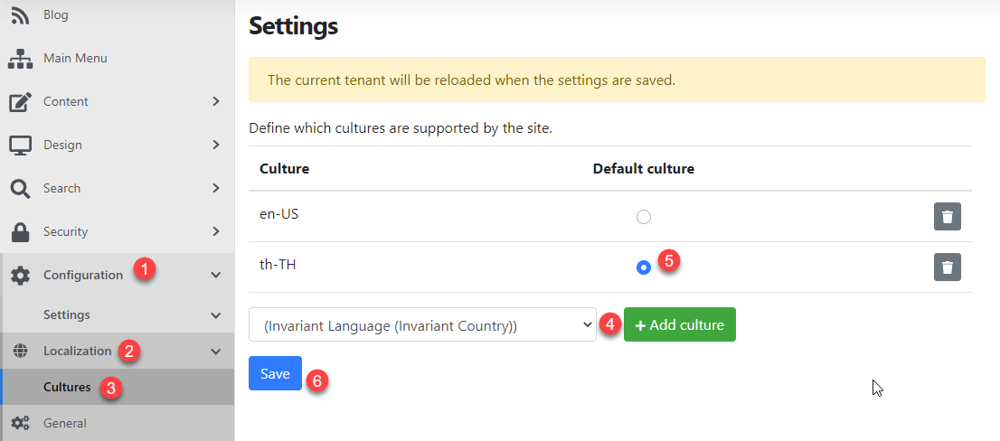

# Prerequisite
- To learn localization in Orchard Core CMS, we will use an existing example from [Create a custom Orchard Core CMS theme content](/web-frameworks/orchard-core-cms/create-a-custom-orchard-core-cms-theme).
- Here is the current project structure:
  ```sh
  $ tree -I 'bin|obj|App_Data|Localization|wwwroot' orchard-example
  orchard-example
  └── src
      ├── OrchardExample.Web
      │   ├── NLog.config
      │   ├── OrchardExample.Web.csproj
      │   ├── Program.cs
      │   ├── Properties
      │   │   └── launchSettings.json
      │   ├── Startup.cs
      │   └── appsettings.json
      └── Themes
          └── OrchardExample.Theme
              ├── Manifest.cs
              ├── OrchardExample.Theme.csproj
              └── Views
                  ├── Layout.cshtml
                  └── _ViewImports.cshtml
  ```
- Please note that you can use localization in both custom theme and module.

# Create a PO file
- Orchard Core CMS uses PO (portable object) file to store translation data.
- We can create a PO file in multiple locations which are module, theme, tenant, App_Data and the root of the main project.
- [Learn more about PO file locations](https://docs.orchardcore.net/en/latest/docs/reference/modules/Localize/#po-files-locations).
- In this example, we will create a PO file in the root folder of the main project (OrchardExample.Web) with a file path `/Localization/[CultureName].po`.
- Culture name is `<language-code>-<country-code or region-code>`. Example patterns are: `th-TH`, `en-US`.
  To learn more about globalization and localization terms, please check this [document](https://docs.microsoft.com/en-us/aspnet/core/fundamentals/localization?view=aspnetcore-5.0#globalization-and-localization-terms-2)
- Let's create a PO file `/src/OrchardExample.Web/Localization/th-TH.po` in `orchard-example` folder.
- Here is the file structure after adding `th-TH.po` file.
```sh
$ tree -I 'bin|obj|wwwroot' orchard-example
orchard-example
└── src
    ├── OrchardExample.Web
    │   ├── App_Data
    │   ├── Localization
    │   │   └── th-TH.po
    │   ├── NLog.config
    │   ├── OrchardExample.Web.csproj
    │   ├── Program.cs
    │   ├── Properties
    │   │   └── launchSettings.json
    │   ├── Startup.cs
    │   └── appsettings.json
    └── Themes
        └── OrchardExample.Theme
            ├── Manifest.cs
            ├── OrchardExample.Theme.csproj
            └── Views
                ├── Layout.cshtml
                └── _ViewImports.cshtml
```

- Add some translation data to `th-TH.po` file.
  ```
  msgid "Copyright"
  msgstr "สงวนลิขสิทธิ์"
  ```

# Use a translation file
- We can use this translation in a view (*.cshtml) by using T property and pass a value of msgid.
- Edit `Layout.cshtml` an put the following code at the bottom.
  ```html
  @T["Copyright"]
  ```
- In addition, to use it in C# code, e.g. Service, Controller, Driver, Handler class, etc. Inject `IStringLocalizer` and use an instance as the following code:
  ```cs
  namespace OrchardExample.Module
  {
      public class HomeController : Controller {

          private readonly IStringLocalizer S;

          public HomeController(IStringLocalizer<HomeController> localizer) => S = localizer;

          public ActionResult Index() => View(S["Copyright"]));
      }
  }
  ```

# Add supported cultures to Orchard Core CMS
- Enable localization module. Go to admin panel > Configuration > Features > Search for "localization" and enable it.
- Add supported cultures and set a default culture.
  1. Click Configuration.
  2. Click Localization.
  3. Click Culture.
  4. Select `th-TH` culture in a select list and click "Add culture".
    Do the same thing to add `en-US` culture.
  5. Set `th-TH` as a default culture.
  6. Click "Save".



# Enable localization from code

        "OrchardCore.Localization",

# Test localization
- Go back to frontend homepage. Append a query string `?culture=th-TH` to an address in a browser and enter to reload the page.
- You should find "Copyright" is displayed as "สงวนลิขสิทธิ์".

# Troubleshooting if setting a default culture in admin panel does not take an effect.
- This is because ASP.NET localization determines a culture by checking a culture value in these areas starting from:
  1. a query string which is `&culture=culture-name`
  2. value in a cookie
  3. Accept-Language HTTP header
  4. the DefaultRequestCulture property of the RequestLocalizationOptions class
  5. value of a thread's culture property
- Orchard Core set a default culture as a DefaultRequestCulture property of the RequestLocalizationOptions class. [OrchardCore.Localization/Startup.cs](https://github.com/OrchardCMS/OrchardCore/blob/main/src/OrchardCore.Modules/OrchardCore.Localization/Startup.cs#L49)
- If we don't have a culture value in query string or a cookie, a culture will be always a value of Accept-Language which sent by a browser and not a default culture that we set in an admin panel.
- To make a culture get resolved to a default value in an admin panel, we need to adjust an order of how ASP.NET determine a culture by putting the following code in `Start.cs` of a custom module, theme or main project.
  ```cs
  // Startup.cs
  public override void ConfigureServices(IServiceCollection services)
  {
      services.Configure<RequestLocalizationOptions>(options =>
      {
          options.RequestCultureProviders.Clear(); // Clears all the default culture providers from the list
          options.RequestCultureProviders.Add(new QueryStringRequestCultureProvider());
          options.RequestCultureProviders.Add(new CookieRequestCultureProvider());
          // Later, the default culture value value will be set in
          // https://github.com/OrchardCMS/OrchardCore/blob/dev/src/OrchardCore.Modules/OrchardCore.Localization/Startup.cs#L45
      });
  }
  ```

# Useful Orchard localization documents
- https://docs.orchardcore.net/en/dev/docs/reference/modules/Localize/
- https://docs.orchardcore.net/en/dev/docs/guides/install-localization-files/#configuring-the-supported-cultures

# Useful basic knowledge of localization in ASP.NET:
- https://www.jerriepelser.com/blog/how-aspnet5-determines-culture-info-for-localization/
- https://www.codemag.com/Article/2009081/A-Deep-Dive-into-ASP.NET-Core-Localization
- https://ml-software.ch/posts/writing-a-custom-request-culture-provider-in-asp-net-core-2-1
- https://docs.microsoft.com/en-us/aspnet/core/fundamentals/localization?view=aspnetcore-5.0
